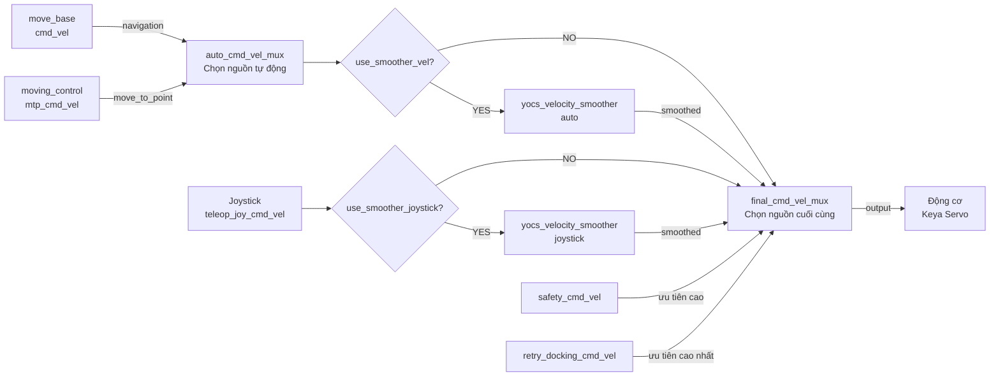
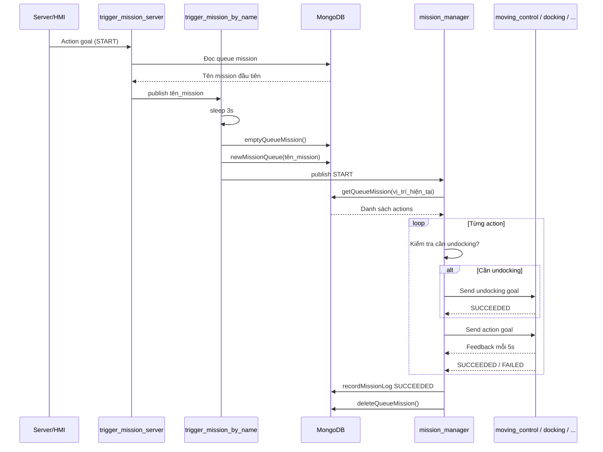
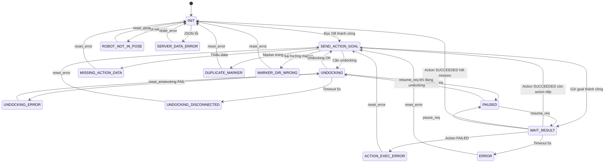
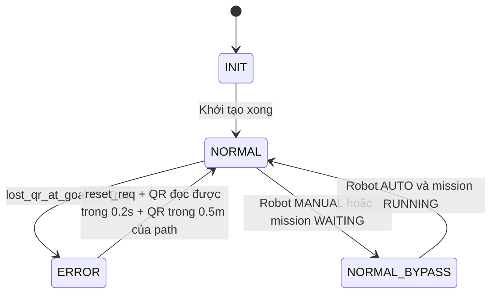
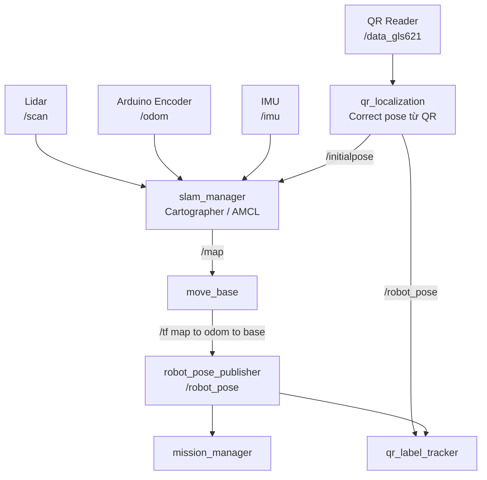
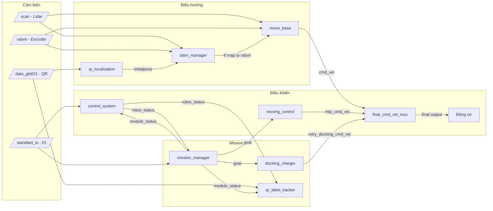

# Tài liệu hệ thống AMR – Lưu đồ tổng quan

## 1. Sơ đồ khởi động hệ thống (`amr_startup.launch`)

```mermaid
graph TD
    START([amr_startup.launch]) --> HW[Hardware Layer]
    START --> NAV[Navigation Layer]
    START --> MISSION[Mission Layer]
    START --> SAFETY[Safety Layer]
    START --> UI[UI / Peripheral Layer]

    HW --> HW1[arduino_bridge\nĐọc encoder, IMU, IO]
    HW --> HW2[amr_bringup\nVelocity mux, Joystick]
    HW --> HW3[robot_pose_publisher\nPublish /robot_pose]
    HW --> HW4[reset_arduino\nWatchdog Arduino]

    NAV --> NAV1[lidar_signal_new\nDriver Lidar]
    NAV --> NAV2[laser_filter\nLọc điểm Lidar]
    NAV --> NAV3[move_base\nNavigation Stack]
    NAV --> NAV4[slam_manager\nQuản lý bản đồ/localization]
    NAV --> NAV5[qr_localization\nLocalization bằng QR]

    MISSION --> M1[control_system\nRobot state machine]
    MISSION --> M2[moving_control\nĐiều khiển di chuyển]
    MISSION --> M3[mission_manager\nQuản lý mission]
    MISSION --> M4[trigger_mission_server\nKích hoạt mission]
    MISSION --> M5[trigger_mission_by_name\nXử lý trigger]

    SAFETY --> S1[safety_tof_sensor\nCảm biến TOF]
    SAFETY --> S2[scan_safety\nAn toàn từ Lidar]

    UI --> UI1[sound_control\nÂm thanh]
    UI --> UI2[led_control\nĐèn LED]
    UI --> UI3[qr_tracker\nTheo dõi QR]
    UI --> UI4[log_odom\nGhi log odometry]
    UI --> UI5[mirror_detect\nPhát hiện gương]
    UI --> UI6[traffic_control\nKiểm soát giao thông]
```

---

## 2. Kiến trúc điều khiển vận tốc

**Thứ tự ưu tiên (cao → thấp):**
1. `retry_docking_cmd_vel` – xử lý lỗi docking
2. `safety_cmd_vel` – dừng khẩn cấp
3. `teleop_joy` – joystick thủ công
4. `auto` – điều hướng tự động

---

## 3. Luồng thực thi Mission

---

## 4. State Machine – Mission Manager

---

## 5. State Machine – QR Label Tracker

**Ghi chú:** Kiểm tra `robot_is_on_label()` đang bị tắt bởi `if False and ...` trong code

---

## 6. Sơ đồ Localization & Bản đồ

---

## 7. Sơ đồ các Topic chính

---

## 8. Tóm tắt các Package chính

| Package | Vai trò | Giao tiếp chính |
|---------|---------|----------------|
| `amr_bringup` | Velocity mux, joystick, hardware init | `/final_cmd_vel_mux/output` |
| `move_base` | Path planning + local planner NEO | `cmd_vel`, `/map`, `/tf` |
| `slam_manager` | Quản lý Cartographer/AMCL, chuyển map | `/map`, `/tf` |
| `qr_localization` | Hiệu chỉnh vị trí bằng QR | `/initialpose`, `/robot_pose` |
| `qr_label_tracker` | Giám sát robot có bám theo QR không | Module status |
| `control_system` | State machine tổng của robot AUTO/MANUAL/ERROR | `robot_status` |
| `moving_control` | Action server di chuyển theo waypoint | `mtp_cmd_vel` |
| `mission_manager` | Điều phối toàn bộ mission từ DB | Action server |
| `docking_charger` | Tự động dock sạc | Action server |
| `trigger_mission_*` | Kích hoạt mission theo tên | MongoDB, `request_start_mission` |
| `yocs_velocity_smoother` | Làm mượt vận tốc tránh giật | Nodelet |
| `safety_tof_sensor` | Cảm biến TOF an toàn | `safety_cmd_vel` |
