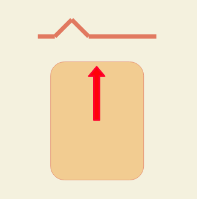
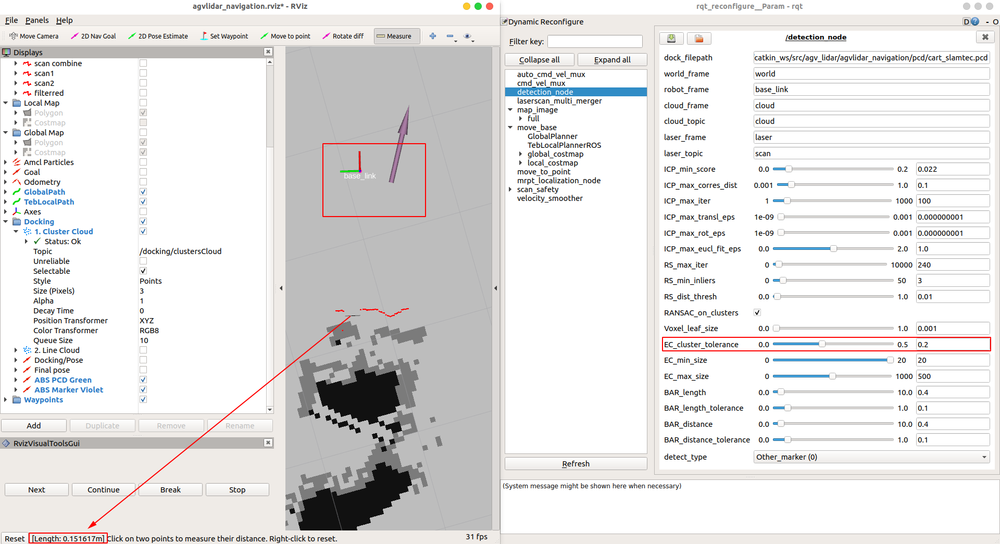
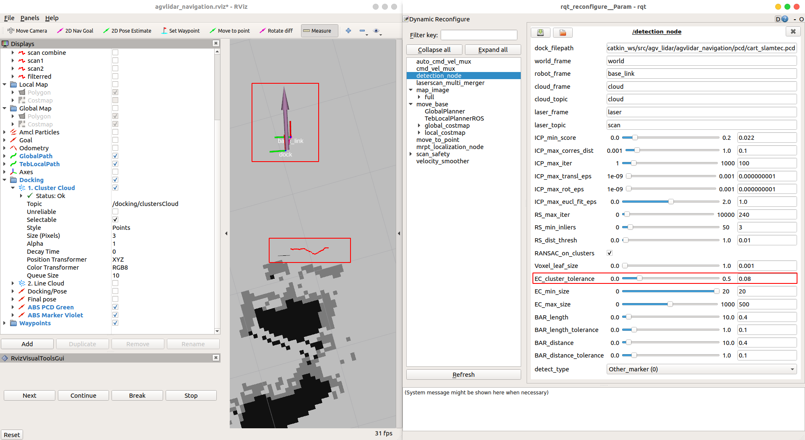
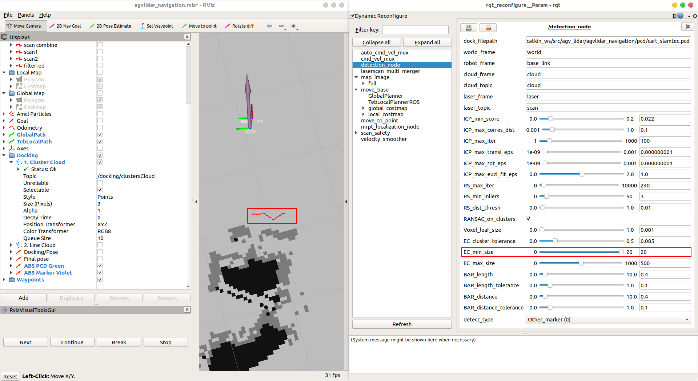
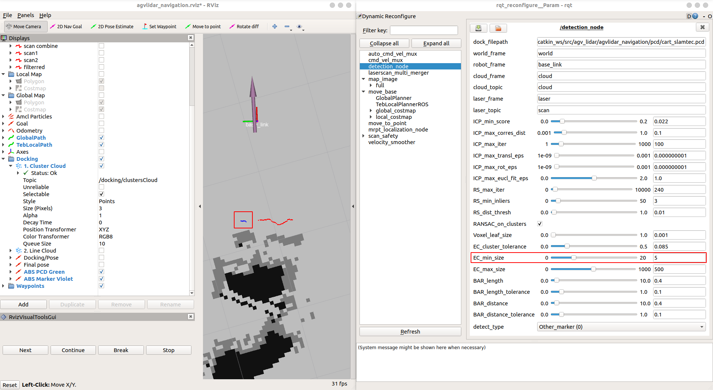

# Docking

Development of ROS package that provides generalized docking solution for LiDAR equipped mobile robots

## Read the [design report](https://github.com/rwbot/docking/blob/master/docking_design_report.pdf)

## MKAC

Purpose:

- For detect dock with VL-Marker (Note: Pose have the same frame_id with laser scan topic)

Run:

```bash
roslaunch docking mkac_get_dock.launch
```

Input:

- `/scan`: topic for laser scan
- `/docking/perform_detection`: Publish this topic with true value for start detecting

Output:

- `/docking/dock_pose`

## Create new marker base

### 1. Record `*.pcd` file

- Đưa robot đến vị trí trước marker như hình vẽ.

  

- Trước khi record `*.pcd` file, cần filter laser bằng pkg `laser_filters` để  chỉ vùng marker được detect. Khi record `*.pcd`, toàn bộ dữ liệu `/scan` sẽ được record (không phải là phần dữ liệu đã lọc ra từ thuật toán Cluster hay Ransac...).

- Chạy lệnh sau để lưu lại file pcd. Lệnh này sẽ tạo ra nhiều file `*.pcd` trong thư mục hiện tại. Chọn 1 trong các file đó, lưu lại thành file pcd. Ví dụ: `vl_marker.pcd`

  ```bash
  rosrun pcl_ros pointcloud_to_pcd input:=cloud
  ```

  Hoặc

  ```bash
  rosrun docking get_pcd.sh
  ```

### 2. Tạo file config và chạy

- Sử dụng file detection_params.yaml làm mẫu, tạo 1 file tương tự có tên tương ứng với loại marker, với `dock_filepath` là đường dẫn tới file PCD vừa tạo. Ví dụ: `vl_marker.yaml`
- Thêm file yaml vừa tạo vào trong file `mkac_get_dock.launch`:

  ```xml
      <node pkg="docking" type="detection_node" name="detection_node" output="screen" respawn="false" clear_params="true" >
          <rosparam file="$(find docking)/config/vl_marker.yaml" />
      </node>
  ```

- Chạy file launch:

  ```bash
  roslaunch docking mkac_get_dock.launch
  ```

- Mở một terminal khác, chạy lệnh để detect marker:

  ```bash
  rostopic pub /docking/perform_detection std_msgs/Bool "data: true" -1
  ```

### 3. Tuning

- Mở dynamic configuration để tùy chỉnh thông số phát hiện marker:

  ```bash
  rosrun rqt_reconfigure rqt_reconfigure
  ```

- B1: Phân cụm (Cluster)

  High_EC_cluster_tolerance:
  
  Low_EC_cluster_tolerance:
  
  High_EC_min_size:
  
  Low_EC_min_size:
  

- B2: Tạo đoạn thẳng (RANSAC)

- B3: Tăng giảm ICP Score

- Sau khi chỉnh sửa, lưu lại các thông số đã chỉnh sửa vào file `vl_marker.yaml` ở trên.

## Sử dụng

- Chạy file launch, với file yaml được load là marker mặc định

  ```bash
  roslaunch docking mkac_get_dock.launch
  ```

- Để thay đổi marker, chỉ cần gửi topic `/docking/select_type` với kiểu `std_msgs/String`, data là tên của marker:

  ```bash
  rostopic pub /docking/select_type std_msgs/String "data: 'vl_marker'" -1
  ```
